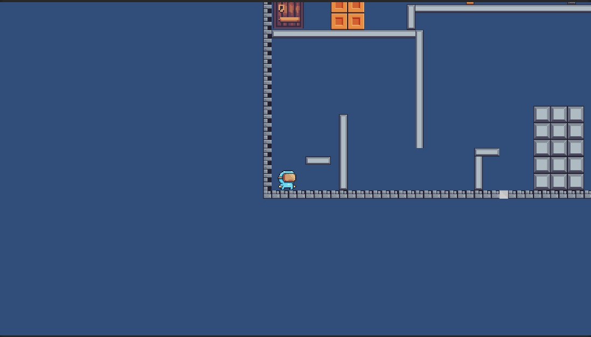
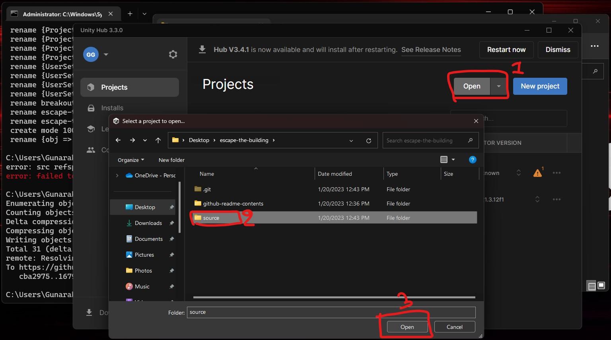

# Escape The Building

## Repo Structure
    .
    ├── source                        - Contains source code of the project.
    ├── github-readme-content         - Contains readme content files.
    ├── LICENCE                       - LICENCE file.
    └── README.MD                     - Readme file.

## Introduction

Welcome to "Escape the Building", a thrilling 2D game that challenges you to outsmart and outmaneuver your way out of a mysterious building. The game is built using Unity, a widely-used game engine, and programmed with C#, providing a smooth and engaging gaming experience.

As the player, you are trapped in a building and must use your wits and ingenuity to find clues, overcome obstacles in order to escape. The building is filled with traps and hazards, so you must be quick and strategic in your movements to avoid them.

**Note:** This game was developed as a prototype, but it is not finished, it has only one level.



## Technology and Frameworks

- Unity Editor 2021.3.5f1 or higher

## Setup

- Open the source folder in unity editor,

```
escape-the-building/source
```



## Demo

https://user-images.githubusercontent.com/45822509/213641027-cee08ebf-a8ee-4863-9bba-9b799163523e.mp4


## Social Links

- [Linkedin](https://www.linkedin.com/in/gunarakulangunaretnam)
- [Facebook](https://www.facebook.com/gunarakulangunaretnam)
- [Instagram](https://www.instagram.com/gunarakulangunaretnam)
- [Twitter](https://twitter.com/gunarakulangr)
- [Kaggle](https://www.kaggle.com/gunarakulangr)
- [TikTok](https://www.tiktok.com/@gunarakulangunaretnam)
- [Youtube](https://www.youtube.com/channel/UCjMOdgHFAjAdBKiqV8y2Tww)
